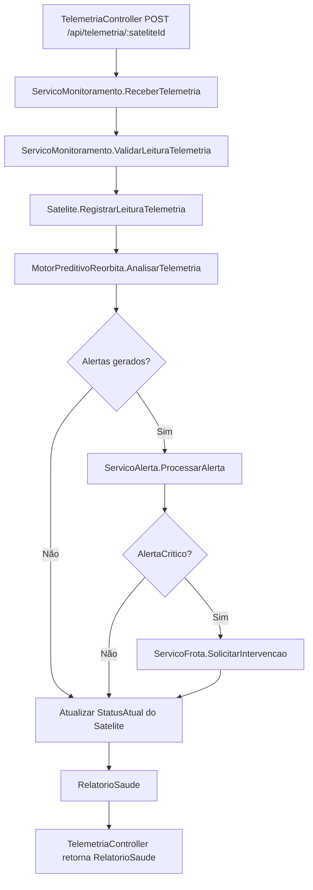

# REORBITA
Plataforma de Inteligência Orbital para monitoramento preditivo de satélites e coordenação de intervenções robóticas.

## 1. Nome e tagline do projeto
REORBITA - Plataforma de Inteligência Orbital para monitoramento preditivo de satélites e coordenação de intervenções robóticas.

## 2. Problema e solução
A proliferação de satélites em fim de vida útil aumenta risco de colisão, perda de serviço e lixo espacial. A REORBITA resolve isso com uma API que recebe telemetria, projeta falhas, gera alertas por severidade e aciona uma frota de robôs orbitais quando necessário.

## 3. Conexão com o tema Space Connect
A proposta conecta monitoramento orbital, continuidade operacional e segurança cibernética em um mesmo fluxo, alinhando o projeto ao tema Space Connect da Global Solution.

## 4. Integrantes
| Nome | RM |
|---|---|
| Bento Rangel | RM559124 |
| Eric Yuji | RM554869 |
| Higor Batista | RM558907 |
| Kaue Pires | RM554403 |
| Ricardo Di Tilia | RM555155 |

## 5. Arquitetura
### 5.1 Fluxo principal (telemetria)


### 5.2 Hierarquia de classes


## 6. Tecnologias utilizadas
- .NET Core
- C#
- Swagger
- System.Text.Json

## 7. Como rodar localmente
### Pré-requisitos
- .NET 8 SDK

### Comandos
```bash
git clone <url-do-repositorio>
cd Reorbita
dotnet restore src/Reorbita.Api/Reorbita.Api.csproj
dotnet run --project src/Reorbita.Api/Reorbita.Api.csproj
```

### Exemplo de acesso para obter JWT
Use o endpoint `/api/auth/token` para gerar um token de acesso de teste.

```bash
curl -X POST "http://localhost:5028/api/auth/token" \
    -H "Content-Type: application/json" \
    -d '{
        "usuarioId": "operadora-demo",
        "operadora": "StarLink BR",
        "nivelAcesso": "OperadoraAdmin",
        "mfaHabilitado": true
    }'
```

No retorno, use o valor de `dados.accessToken` no header:

```text
Authorization: Bearer <SEU_TOKEN_JWT>
```

Swagger local:
- https://localhost:{porta}/swagger

## 8. Endpoints principais
| Método | Rota | Descrição | Autenticação necessária |
|---|---|---|---|
| POST | /api/auth/token | Gera token JWT para testes no ambiente de desenvolvimento | Não |
| GET | /api/satelites | Lista satélites da operadora autenticada | JWT |
| GET | /api/satelites/{id} | Busca satélite por ID | JWT |
| POST | /api/satelites | Cadastra novo satélite | JWT + papel OperadoraEscrita, OperadoraAdmin ou ReorbitaAdmin |
| PUT | /api/satelites/{id} | Atualiza satélite | JWT + papel OperadoraEscrita, OperadoraAdmin ou ReorbitaAdmin |
| POST | /api/telemetria/{sateliteId} | Recebe leitura e retorna relatório de saúde | JWT + rate limiting |
| GET | /api/telemetria/{sateliteId}/historico | Consulta histórico de telemetria por período | JWT |
| GET | /api/alertas | Lista alertas da operadora autenticada | JWT |
| GET | /api/alertas/{sateliteId} | Lista alertas de um satélite | JWT |
| POST | /api/frota/intervencao | Solicita intervenção orbital | JWT + papel OperadoraAdmin ou ReorbitaAdmin + canal mTLS (configurável) |
| GET | /api/frota/ordens | Lista ordens de serviço | JWT + papel de leitura/escrita/admin |
| GET | /api/frota/robos | Lista disponibilidade dos robôs | JWT + papel de leitura/escrita/admin |

## 9. Estrutura do projeto
```text
REORBITA/
├── src/
│   └── Reorbita.Api/
│       ├── Controllers/
│       ├── Domain/
│       │   ├── Entities/
│       │   ├── Interfaces/
│       │   ├── Structs/
│       │   ├── Enums/
│       │   └── Exceptions/
│       ├── Services/
│       ├── Infrastructure/
│       ├── Models/
│       │   ├── Requests/
│       │   └── Responses/
│       ├── Program.cs
│       └── appsettings.json
├── evidencias/
└── README.md
```

## 10. Evidências de execução
### Evidência 01 - Criar satélite


### Evidência 02 - Telemetria normal


### Evidência 03 - Telemetria crítica com alerta


### Evidência 04 - Intervenção da frota


### Evidência 05 - Histórico filtrado

