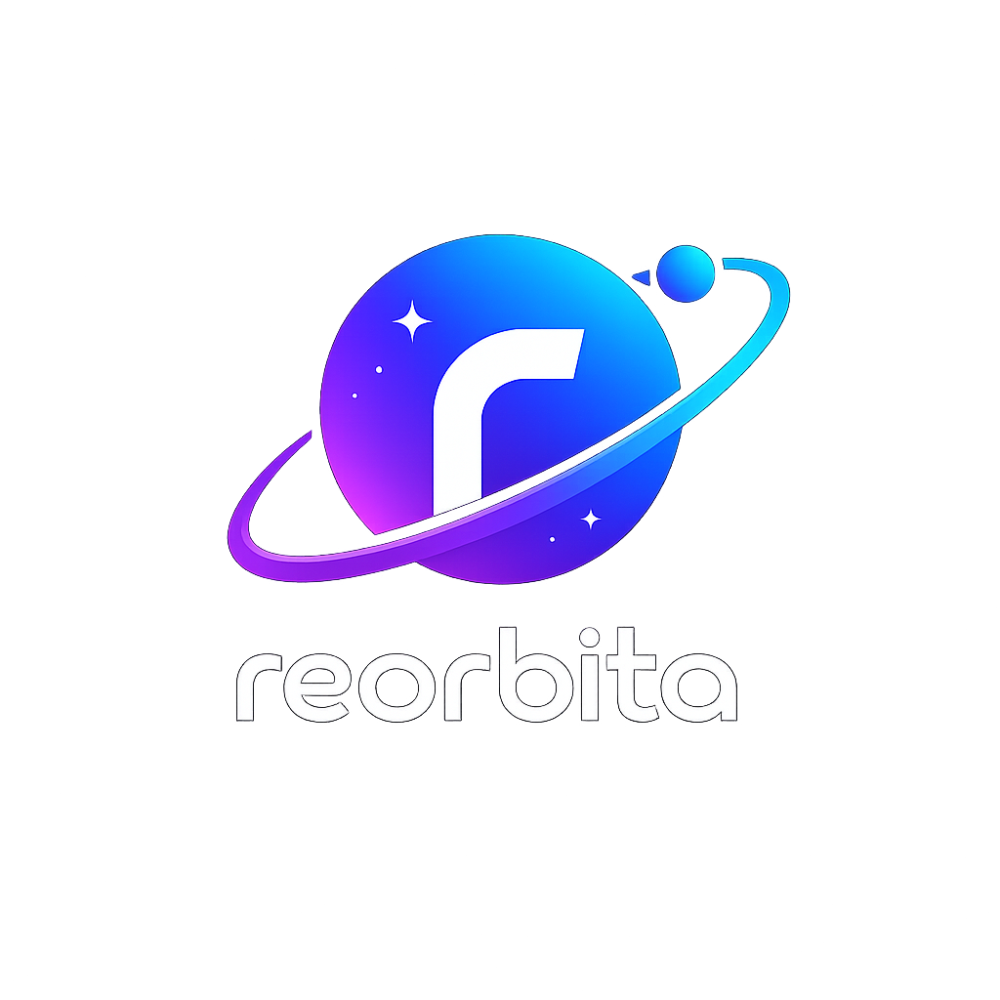
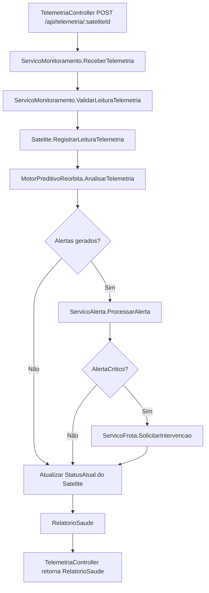
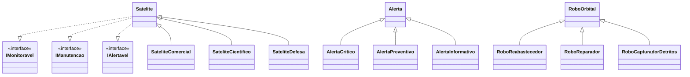
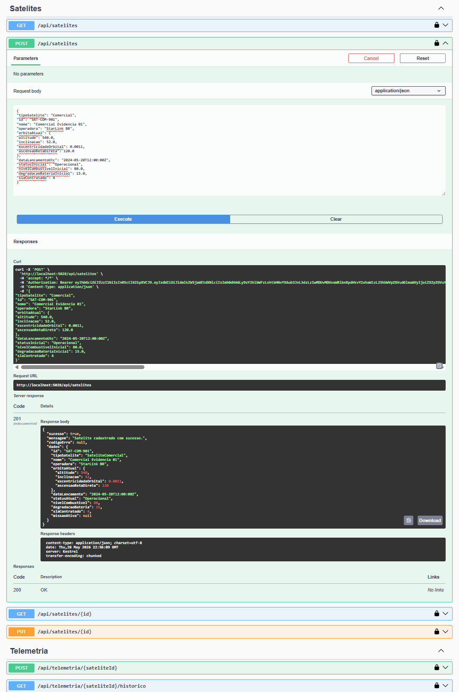
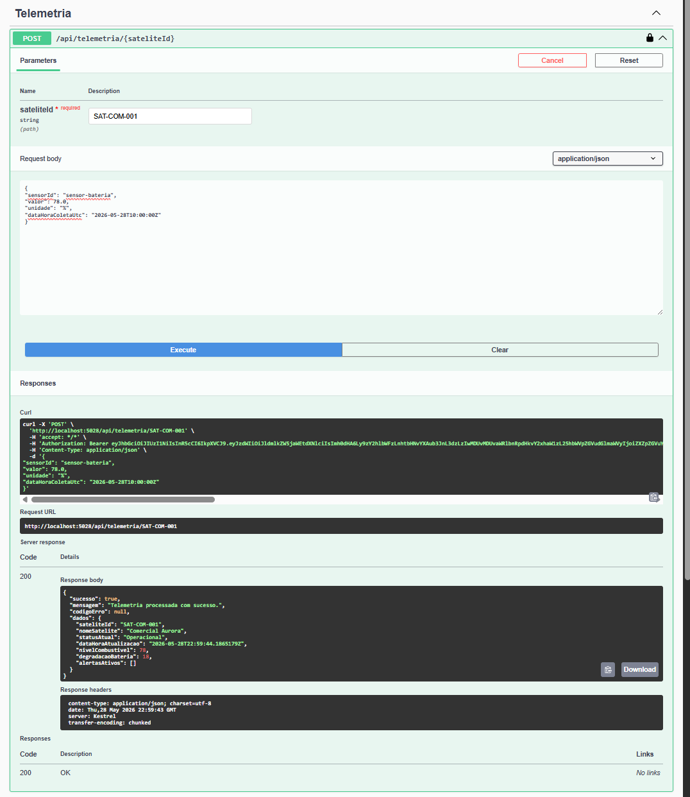
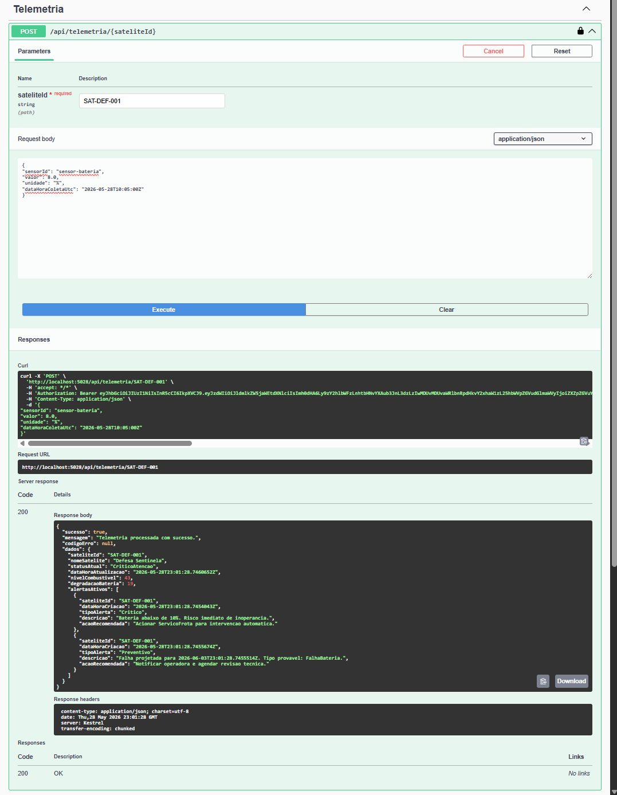
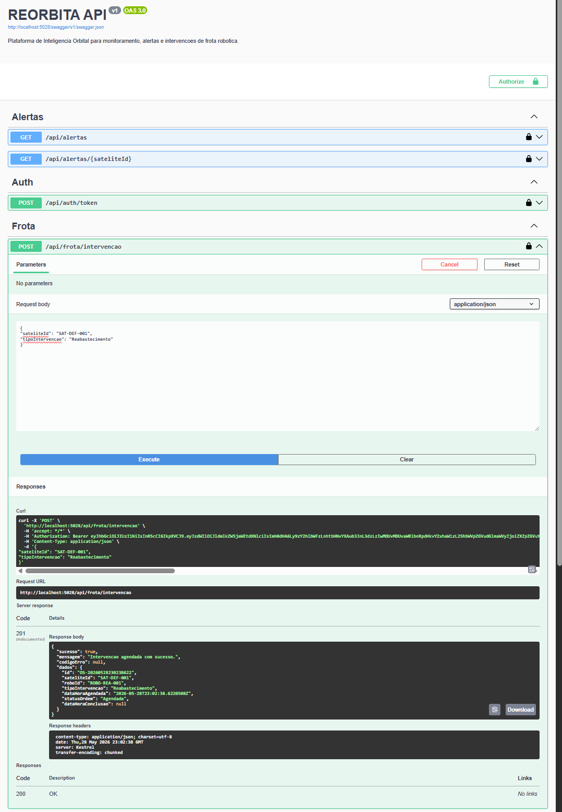
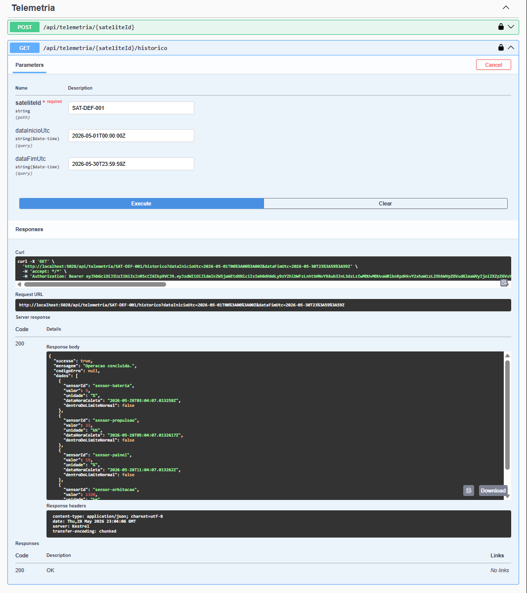

<h1> REORBITA</h1>
Ecossistema de manutenção orbital para monitoramento preditivo de satélites e coordenação de intervenções robóticas.

## 1. Nome e tagline do projeto
REORBITA - Ecossistema de manutenção orbital para prolongar a vida útil de satélites com inteligência preditiva e suporte robótico.

## 2. Problema e solução
Mais de 60% dos satélites lançados na última década ainda estarão em órbita em 2035, mas muitos perderão utilidade antes disso por falhas pontuais, degradação de bateria e esgotamento de combustível. O resultado é perda de ativos de alto valor e aumento de lixo espacial.

A REORBITA propõe um ecossistema integrado de manutenção orbital apoiado em três pilares:

- Plataforma de Inteligência Orbital: cria uma visão operacional do satélite a partir de telemetria e histórico, com análise preditiva para antecipar falhas e priorizar ação antes da indisponibilidade.
- Frota de robôs modulares de reparo: organiza intervenções especializadas (reabastecimento, troca de módulo, correção de trajetória e captura de detritos) de forma coordenada.
- Protocolo Orbit-Ready: define uma direção de padronização para satélites reparáveis e atualizáveis em órbita, reduzindo descarte prematuro.

No escopo desta entrega em C#, a API implementa de ponta a ponta os fluxos de monitoramento preditivo, geração de alertas e solicitação de intervenção da frota, estabelecendo a base técnica para evolução dos demais componentes do ecossistema.

## 3. Conexão com o tema Space Connect
A proposta se conecta ao Space Connect ao integrar software, operação orbital e segurança em uma mesma arquitetura, com foco em três frentes: sustentabilidade orbital (redução de satélites inoperantes e risco de detritos), economia circular no espaço (extensão de vida útil e reaproveitamento) e novo modelo de serviço contínuo para operadoras.

## 4. Integrantes
| Nome | RM |
|---|---|
| Bento Rangel | RM559124 |
| Eric Yuji | RM554869 |
| Higor Batista | RM558907 |
| Kaue Pires | RM554403 |
| Ricardo Di Tilia | RM555155 |

## 5. Arquitetura
### 5.1 Fluxo principal (telemetria)


### 5.2 Hierarquia de classes


## 6. Tecnologias utilizadas
- .NET Core
- C#
- Swagger
- System.Text.Json

## 7. Como rodar localmente
### Pré-requisitos
- .NET 8 SDK

### Comandos
```bash
git clone <url-do-repositorio>
cd Reorbita
dotnet restore src/Reorbita.Api/Reorbita.Api.csproj
dotnet run --project src/Reorbita.Api/Reorbita.Api.csproj
```

### Exemplo de acesso para obter JWT
Use o endpoint `/api/auth/token` para gerar um token de acesso de teste.

```bash
curl -X POST "http://localhost:5028/api/auth/token" \
    -H "Content-Type: application/json" \
    -d '{
        "usuarioId": "operadora-demo",
        "operadora": "StarLink BR",
        "nivelAcesso": "OperadoraAdmin",
        "mfaHabilitado": true
    }'
```

No retorno, use o valor de `dados.accessToken` no header:

```text
Authorization: Bearer <SEU_TOKEN_JWT>
```

Swagger local:
- https://localhost:{porta}/swagger

## 8. Endpoints principais
| Método | Rota | Descrição | Autenticação necessária |
|---|---|---|---|
| POST | /api/auth/token | Gera token JWT para testes no ambiente de desenvolvimento | Não |
| GET | /api/satelites | Lista satélites da operadora autenticada | JWT |
| GET | /api/satelites/{id} | Busca satélite por ID | JWT |
| POST | /api/satelites | Cadastra novo satélite | JWT + papel OperadoraEscrita, OperadoraAdmin ou ReorbitaAdmin |
| PUT | /api/satelites/{id} | Atualiza satélite | JWT + papel OperadoraEscrita, OperadoraAdmin ou ReorbitaAdmin |
| POST | /api/telemetria/{sateliteId} | Recebe leitura e retorna relatório de saúde | JWT + rate limiting |
| GET | /api/telemetria/{sateliteId}/historico | Consulta histórico de telemetria por período | JWT |
| GET | /api/alertas | Lista alertas da operadora autenticada | JWT |
| GET | /api/alertas/{sateliteId} | Lista alertas de um satélite | JWT |
| POST | /api/frota/intervencao | Solicita intervenção orbital | JWT + papel OperadoraAdmin ou ReorbitaAdmin + canal mTLS (configurável) |
| GET | /api/frota/ordens | Lista ordens de serviço | JWT + papel de leitura/escrita/admin |
| GET | /api/frota/robos | Lista disponibilidade dos robôs | JWT + papel de leitura/escrita/admin |

## 9. Estrutura do projeto
```text
REORBITA/
├── src/
│   └── Reorbita.Api/
│       ├── Controllers/
│       ├── Domain/
│       │   ├── Entities/
│       │   ├── Interfaces/
│       │   ├── Structs/
│       │   ├── Enums/
│       │   └── Exceptions/
│       ├── Services/
│       ├── Infrastructure/
│       ├── Models/
│       │   ├── Requests/
│       │   └── Responses/
│       ├── Program.cs
│       └── appsettings.json
├── evidencias/
└── README.md
```

## 10. Evidências de execução
### Evidência 01 - Criar satélite
Criação de um novo satélite via endpoint `POST /api/satelites`, com payload completo e resposta de sucesso.


### Evidência 02 - Telemetria normal
Envio de telemetria dentro dos limites esperados para satélite operacional, sem geração de alerta crítico.


### Evidência 03 - Telemetria crítica com alerta
Envio de telemetria de bateria crítica para demonstrar detecção de risco e retorno com alerta de severidade alta.


### Evidência 04 - Intervenção da frota
Solicitação de intervenção orbital para alocação de robô e geração da ordem de serviço correspondente.


### Evidência 05 - Histórico filtrado
Consulta do histórico de telemetria com filtro por intervalo de datas, retornando apenas leituras do período informado.

